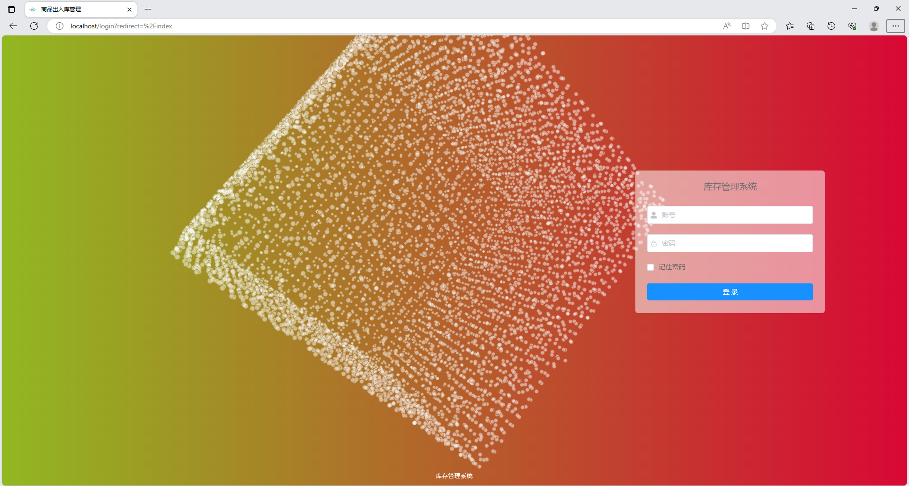

# 仓库进销存管理系统

基于springboot+vue的前后端分离管理系统

## 一、介绍

基于springboot+vue的前后端分离系统

运行环境:idea或eclipse vscode 数据库:mysql

开发语言：java

可做 仓库进销存管理系统 仓库库存管理系统 商品进销存管理系统 商品库存管理系统

标价就是实际价格，可以直接拍，看到会第一时间发货，网盘发货。由于物品的可复制性，一经售出（发货后），不退不换，介意勿拍。

基于springboot+vue的前后端分离管理系统

技术栈：ruoyi、springboot、springcloud、redis、mybatis、maven、vue

功能模块：用户管理、部门管理、岗位管理、供应商信息、商品信息管理、商品入库、商品出库、商品库存、库存不足预警、商品过期警告、操作日志、登录日志
商品退回

## 二、系统部分功能界面截图

## 三、9.9￥获取完整源码和sql，需要可以+扣扣：3577148218，或者+ wx ：xzxj0206

